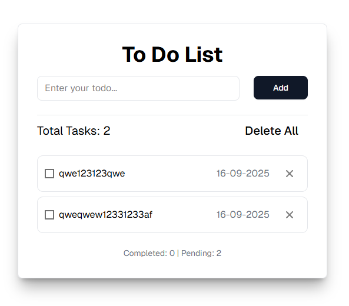

# 📝 To Do List на Next пробный

Простое, минималистичное приложение "To Do List", написанное базовом Next из коробки, не настраивая практически ничего. Используя Next в первый раз.

Цель проекта — сделать, демо Todo List с сменой темы. Это учебный пример .

## 📸 Дизайн

Интерфейс взят из бесплатного макета Figma. Выглядит чисто и понятно:

<div align="center">
        </a>
</div>

🔗 [Ссылка на макет в Figma](https://www.figma.com/design/5g3oOYX6GNlezUCuk1xmaS/To-Do-List)

## ⚙️ Возможности

- ✅ Добавление новой задачи (через отдельное поле)
- ✅ Отметка задачи как выполненной
- ✅ Удаление одной задачи
- ✅ Удаление всех задач
- ✅ Счётчик количества задач (выполненных и в процессе выполнения)
- ✅ Сохранение всех данных в `localStorage`
- ✅ Поддержка Enter-клавиши и автофокуса

## 💡 Стек

- **HTML5**
- **CSS3**
- **JavaScript (ES6+)**  
- **React**  
- **Vite**
- **Shadcn ui**

## 🚀 Как запустить

1. Клонируй репозиторий:

```bash
git clone git@github.com:aleksanderlamkov/todo-vanilla.git
```

2. В консоль написать  ```npm run dev```, в браузере будет рабочий вариант в режиме разработки.
